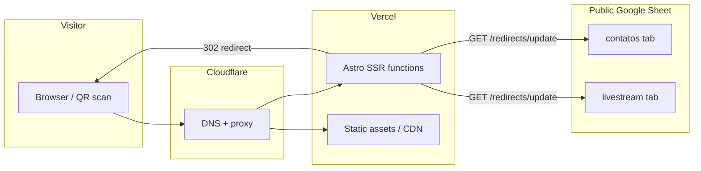

# brasadrones.com.br — Documentation

This folder is the living documentation for the site: how it's built, what's on it, and how it should evolve. It is meant to be updated as the project changes — when you add a page, change infrastructure, or make a brand decision, update the relevant doc in the same change.

## Map

| Doc | Covers |
| --- | --- |
| [technical/architecture.md](technical/architecture.md) | Astro/Vercel/Cloudflare setup, deployment, local dev, known infra issues |
| [pages/overview.md](pages/overview.md) | Every route on the site, what it does, live vs. template scaffolding |
| [components/overview.md](components/overview.md) | Every reusable component, props, who uses it |
| [features/redirects.md](features/redirects.md) | The spreadsheet-driven redirect system and **why it must stay consistent for QR codes** |
| [design/ui-ux-marketing.md](design/ui-ux-marketing.md) | Brand/visual state, marketing-material guidance, open design decisions |

## Why this exists

The codebase started from the [Astroship](https://web3templates.com) Astro template. Most of the original template pages (`/about`, `/blog`, `/pricing`, `/contact`) are still unmodified placeholder content — only the homepage (`/`) and the redirect system have been customized for brasadrones so far. The docs below call out explicitly what's **live** vs. **template scaffolding** so future work knows what's safe to change or remove.

## How to keep these docs useful

- When a page or component's purpose changes, edit its row in the relevant overview table — don't let it go stale.
- When you add a new feature (not just a page), give it its own file under `features/`.
- Treat `features/redirects.md` as required reading before editing the spreadsheet — it documents a constraint (QR code permanence) that isn't visible anywhere in the code itself.
