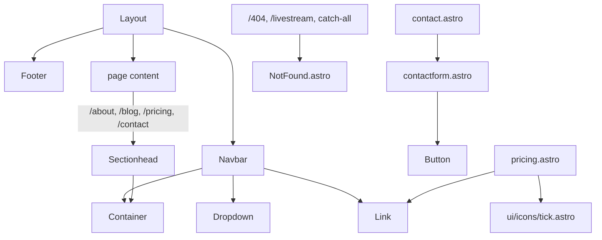

# Components

Every reusable component under `src/components/`. Status legend matches [pages/overview.md](../pages/overview.md): ✅ Live, 🚧 Template scaffold (used only by scaffold pages), 🔧 Utility, ⚠️ Unused/orphaned.

## Layout & structure

### Layout (`src/layouts/Layout.astro`)
The global HTML shell. Props: `title: string`, `showNavbar?: boolean` (default `true`), `showFooter?: boolean` (default `true`). Renders SEO tags via `astro-seo` (canonical URL, OG image, Twitter card — see the stale-domain issue in [technical/architecture.md](../technical/architecture.md)), conditionally renders `Navbar`/`Footer`, loads global fonts/CSS. Used by every page.

### Container (`src/components/container.astro`)
Centered max-width wrapper with responsive padding. No real props beyond `class`. ✅ Used by nearly every page/layout.

### Sectionhead (`src/components/sectionhead.astro`)
Section heading with `title`/`desc` slots, optional `align="center"`. 🚧 Used by `/pricing`, `/contact`, `/blog`, `/about` only.

### Footer (`src/components/footer.astro`)
Static footer with dynamic copyright year and Web3Templates attribution (template leftover — should be replaced with brasadrones attribution/links once decided). Rendered by `Layout` unless `showFooter={false}` (currently the case on the homepage).

### NotFound (`src/components/NotFound.astro`)
🔧 Shared not-found content (title/heading), used by `/404`, `/livestream` (when no sheet row matches), and the catch-all redirect route (when no sheet row matches) so all three render identical 404 markup and can each set `Astro.response.status = 404` independently.

## Navigation

### Navbar (`src/components/navbar/navbar.astro`)
🚧 Full nav bar (logo, dropdown, mobile menu) via `astro-navbar`. Menu items are hardcoded template placeholders (a "Features" dropdown with dead links, a "404 Page" link, and an external "Pro Version" upsell link to web3templates.com) — see the open question in [pages/overview.md](../pages/overview.md). Not rendered on the homepage.

### Dropdown (`src/components/navbar/dropdown.astro`)
🚧 Submenu used only by `Navbar`. Props: `title: string`, `children: {title, path}[]`, `lastItem?: boolean`.

## Marketing sections (template scaffold, currently unused)

These were part of the original Astroship marketing homepage and are **not imported by any current page** (the homepage was replaced by the Instagram link-bio card). They're dead code today but kept here in case a future marketing homepage reuses them:

- ⚠️ **hero.astro** — two-column hero w/ CTA buttons, `astro-icon`.
- ⚠️ **logos.astro** — tech-logo strip (React/Svelte/Astro/Tailwind/Alpine/Vercel) — not brasadrones-relevant content even if revived.
- ⚠️ **cta.astro** — dark call-to-action band.
- ⚠️ **features.astro** — 3-column feature grid with generic Astro-template copy.

## Contact

### contactform (`src/components/contactform.astro`)
🚧⚠️ **Non-functional.** Posts to Web3Forms (`https://api.web3forms.com/submit`) but the `access_key` hidden input is still the placeholder `YOUR_ACCESS_KEY_HERE` (line 13). Until a real Web3Forms access key is set, every submission on `/contact` silently fails from the business's perspective (the visitor sees a client-side error/no confirmation). See [design/ui-ux-marketing.md](../design/ui-ux-marketing.md).

## UI primitives

### Link (`src/components/ui/link.astro`)
Anchor styled as a button. Props: `href` (required), `size?: "md"|"lg"` (default `lg`), `style?: "outline"|"primary"|"inverted"|"muted"` (default `primary`), `block?: boolean`, `class?`, plus passthrough rest props (`target`, `rel`, etc.). Used by `cta`, `hero`, `navbar`, `pricing`.

### Button (`src/components/ui/button.astro`)
Native `<button>` with matching styles. Props: `size?: "md"|"lg"` (default `md`), `style?: "outline"|"primary"` (default `primary`), `block?`, `class?`. Used only by `contactform`.

### Tick icon (`src/components/ui/icons/tick.astro`, re-exported via `index.js`)
SVG checkmark used in the `/pricing` feature lists.

## Utilities

### `src/utils/all.js`
`getFormattedDate(date)` — formats a `Date` to a locale string (`"Jan 01, 2026"`-style). Used by `BlogLayout`/blog rendering.

### `src/lib/redirects.ts`
Not a UI component — the data layer for the redirect system. Documented in [features/redirects.md](../features/redirects.md).

## Composition map

