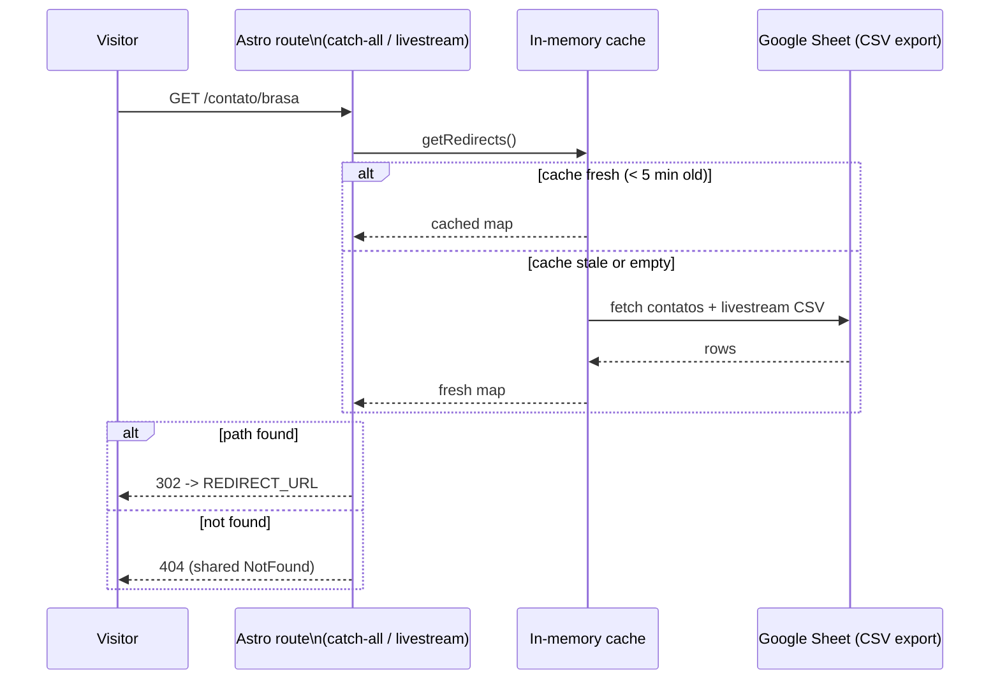
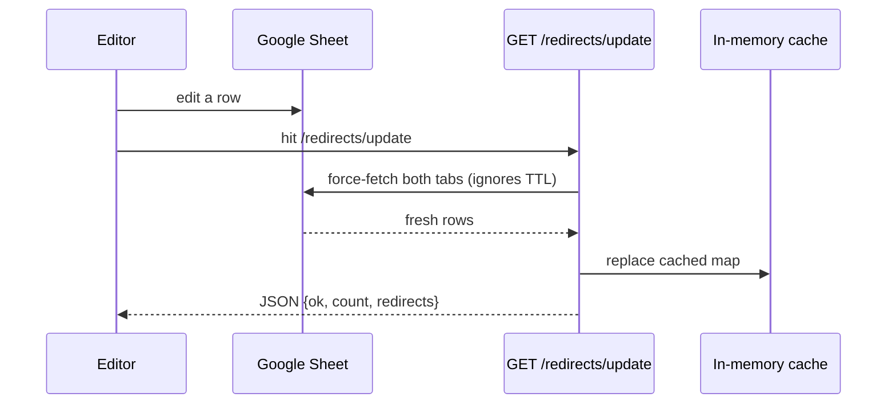

# Feature: Spreadsheet-driven redirects

## What it does

A public Google Sheet is the single source of truth for a set of URL redirects served by this site. Editors who aren't touching code can add/update redirect targets by editing the sheet.

**Spreadsheet**: `1Lv_eUhEMGIFopC0FK4wXrl25ETOIMh_F9veHH_5kOco`, shared as "anyone with the link can view." Two tabs, `contatos` and `livestream`, both shaped:

| ID | REDIRECT_URL | OUTPUT |
| --- | --- | --- |
| brasa | `https://instagram.com/brasadrones` | `https://brasadrones.com.br/contato/brasa` |

- **`OUTPUT`** — a URL on this site. Its *path* (e.g. `/contato/brasa`) is what the site listens for.
- **`REDIRECT_URL`** — where that path 302-redirects to.
- **`ID`** — a human label for the row (not currently used for routing, just bookkeeping).

## How it's implemented

| Piece | File |
| --- | --- |
| Fetch/parse/cache logic | [src/lib/redirects.ts](../../src/lib/redirects.ts) |
| Force-refresh endpoint (`GET /redirects/update`) | [src/pages/redirects/update.ts](../../src/pages/redirects/update.ts) |
| Serves any `OUTPUT` path not matched by another route | [src/pages/\[...redirect\].astro](../../src/pages/%5B...redirect%5D.astro) |
| Serves the `/livestream` path specifically (it's also a static route, which wins routing priority over the catch-all) | [src/pages/livestream.astro](../../src/pages/livestream.astro) |

Both tabs are fetched via Google's public CSV export (`/gviz/tq?tqx=out:csv&sheet=<tab>`) — no API key, because the sheet is public. Rows are parsed into a `Map<path, {id, target, source}>`, held in an **in-memory cache** with a 5-minute TTL.

Because the cache lives in serverless-function memory, a cold-started function will fetch fresh from the sheet automatically on its first request even without hitting `/redirects/update` — the explicit endpoint exists so a change can be made *live immediately*, instead of waiting up to 5 minutes (or for a cold start) for it to take effect naturally.

## Why consistency matters: this drives physical QR codes

**This is the most important constraint of this feature, and it isn't visible anywhere in the code.** The whole reason this redirect layer exists is so that **the `OUTPUT` path can be printed on physical material — QR codes on flyers, drone packaging, banners, business cards, social bios — as a permanent address**, while the actual destination (`REDIRECT_URL`) stays editable.

A QR code encodes a fixed string at print time. Once `https://brasadrones.com.br/contato/brasa` is printed on something physical, **that exact URL can never be changed** — there is no way to "reprint" a QR code that's already on a flyer in someone's hand or a sticker on a drone case.

This means the sheet has to be edited with that constraint in mind:

- **`OUTPUT` paths are permanent once they might be in the wild.** Treat each row's path as append-only: never delete a row or change its `OUTPUT` value if there's any chance a QR code or printed link using it already exists. Doing so turns every copy of that QR code into a dead link (404) with no way to fix it after the fact.
- **`REDIRECT_URL` is the only field meant to change.** Want last year's "livestream" QR code to point at this year's stream? Update `REDIRECT_URL` on that row — the `OUTPUT` path (and therefore every already-printed QR code pointing at it) keeps working unchanged.
- **New campaigns/materials get new rows**, not edits to existing ones, unless you're certain nothing has been printed yet with the old `OUTPUT`.
- **Before any print run**, confirm the path with whoever is editing the sheet, and verify it resolves (see "Testing a change" below) before sending art to print.

A practical safeguard: keep a column or separate tab in the sheet noting *where* each `OUTPUT` path has been physically deployed (e.g. "500 flyers, June 2026 drone expo") so editors can see the blast radius before touching a row. This isn't enforced by the code — it's a process the sheet's editors need to follow.

## Testing a change

1. Edit the sheet.
2. Hit `GET https://brasadrones.com.br/redirects/update` and confirm the JSON response includes the row you changed, with the expected `target`.
3. Visit the actual `OUTPUT` path and confirm it 302s to the right place.
4. For anything time-critical (e.g. swapping the livestream link minutes before an event goes live), do this *immediately* after editing — don't rely on the 5-minute lazy refresh.

## Known limitations / ideas for improvement

- **No validation of duplicate `OUTPUT` paths.** If the same path appears in both tabs (or twice in one tab), whichever is processed last silently wins, with no warning. Worth adding a check in `buildRedirectMap()` that logs/flags collisions.
- **No alerting if the sheet fetch fails.** `getRedirects()` falls back to a stale cache if one exists, but if a function cold-starts right after the sheet becomes unreachable (renamed tab, sheet made private, network issue), redirects fail with no notification.
- **Cache is per-function-instance, not durable.** This was a deliberate simplicity tradeoff (see `docs/technical/architecture.md`) over a durable store like Vercel KV/Edge Config. Revisit if cold-start latency or cross-instance consistency becomes a real problem.
- **The spreadsheet must stay public** ("anyone with the link can view") — there's no authenticated Sheets API call. If it's ever locked down, the fetch breaks silently.
