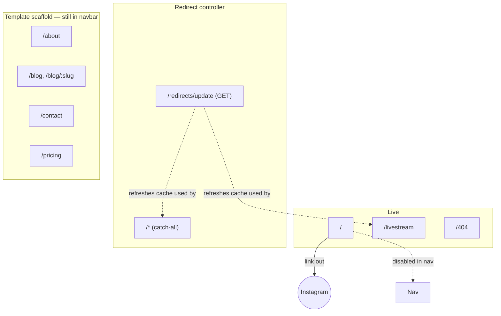

# Pages

Every route under `src/pages/`. Status legend:

- ✅ **Live** — actual brasadrones content/behavior, in active use.
- 🚧 **Template scaffold** — unmodified (or barely modified) Astroship template content. Still reachable on the live site via the navbar, but not brasadrones-specific.
- 🔧 **Utility** — infrastructure plumbing, not a content page.

| Route | File | Status | Purpose |
| --- | --- | --- | --- |
| `/` | [index.astro](../../src/pages/index.astro) | ✅ Live | Homepage. A single full-screen "link in bio" card linking out to the brasadrones Instagram. Navbar/footer explicitly disabled (`showNavbar={false} showFooter={false}`). |
| `/livestream` | [livestream.astro](../../src/pages/livestream.astro) | ✅ Live | Looks up `/livestream` in the spreadsheet-driven redirect map (`livestream` tab) and 302s there; renders the shared 404 if no row matches. See [redirects feature](../features/redirects.md). |
| `/redirects/update` | [redirects/update.ts](../../src/pages/redirects/update.ts) | 🔧 Utility | API endpoint (GET). Forces a fresh fetch of both spreadsheet tabs and returns the resulting redirect map as JSON. See [redirects feature](../features/redirects.md). |
| `/<anything else>` | [\[...redirect\].astro](../../src/pages/%5B...redirect%5D.astro) | 🔧 Utility | Catch-all rest-parameter route (lowest routing priority — never shadows the routes above or below it). Looks up the requested path in the redirect map; 302s on a match, otherwise renders the shared 404. |
| `/404` | [404.astro](../../src/pages/404.astro) | 🔧 Utility | Thin wrapper around the shared [`NotFound`](../components/overview.md#notfound) component. Reused by the catch-all and `/livestream` for consistent not-found rendering. |
| `/about` | [about.astro](../../src/pages/about.astro) | 🚧 Template scaffold | Renders the `team` content collection (fake bios/avatars from the template, e.g. "Janette Lynch"). |
| `/blog` | [blog.astro](../../src/pages/blog.astro) | 🚧 Template scaffold | Lists the `blog` content collection (template's generic web-dev articles), newest first. |
| `/blog/[slug]` | [blog/\[slug\].astro](../../src/pages/blog/%5Bslug%5D.astro) | 🚧 Template scaffold | Renders a single blog post via `getStaticPaths()`. |
| `/contact` | [contact.astro](../../src/pages/contact.astro) | 🚧 Template scaffold | Contact info + the contact form. **Form submission is non-functional** — see [components/overview.md#contactform](../components/overview.md#contactform). |
| `/pricing` | [pricing.astro](../../src/pages/pricing.astro) | 🚧 Template scaffold | Hardcoded SaaS-style pricing table (Personal/Startup/Enterprise) with placeholder prices — not relevant to a drone services business as-is. |

## Open question for whoever owns this next

`/about`, `/blog`, `/pricing`, and `/contact` are still linked from the navbar (`src/components/navbar/navbar.astro`) even though they're unmodified template content in English, while the live homepage is Portuguese and Instagram-first. Decide whether to:
1. Customize these pages for the actual drone business (services, team, pricing), or
2. Remove/hide them from navigation until they are, so the public site doesn't expose template filler content.

See [design/ui-ux-marketing.md](../design/ui-ux-marketing.md) for more on this.
