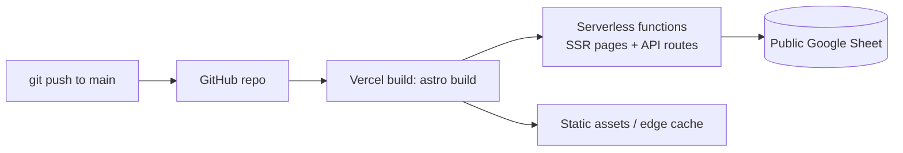

# Technical Architecture

## Stack

- **Framework**: [Astro 5](https://astro.build) (`astro@^5.5.2`), `output: "server"` — every page/route is SSR-capable by default, not static-only.
- **Styling**: Tailwind CSS 4 via `@tailwindcss/vite`.
- **Content**: Astro Content Collections (`src/content/`) for blog posts and team bios.
- **Integrations**: `@astrojs/mdx`, `@astrojs/sitemap`, `astro-icon`, `astro-seo`, `astro-navbar`.
- **Package manager**: pnpm (see `pnpm-workspace.yaml`); npm/yarn lockfiles also exist from the original template but pnpm is the one actually used in `docker-compose.yml`.

Config lives in [astro.config.mjs](../../astro.config.mjs).

## Hosting: Vercel

The site deploys to **Vercel** via the `@astrojs/vercel` adapter (`astro.config.mjs:11`), with `output: "server"`. In practice that means:

- Every `.astro` page and API route (`src/pages/**/*.ts`) is bundled as a Vercel serverless function unless it explicitly opts into prerendering.
- Pages that don't need per-request logic should set `export const prerender = true;` (or rely on default static behavior) to avoid an unnecessary function invocation — most of the template pages (`/about`, `/blog`, `/pricing`, `/contact`) are effectively static content and are good candidates for this once confirmed.
- Pages that must run per-request — the redirect system (`/redirects/update`, `/livestream`, the catch-all `[...redirect]`) — set `export const prerender = false;` deliberately. See [features/redirects.md](../features/redirects.md).
- Deploys are triggered by pushing to the GitHub repo (`git@github.com:brasadrones/brasadrones.com.br.git`); Vercel's GitHub integration builds (`astro build`) and deploys automatically on push to `main` (assuming standard Vercel project linkage — confirm in the Vercel dashboard if this doc and the dashboard ever disagree).



## DNS / Edge: Cloudflare

Cloudflare manages DNS (and likely proxying/caching) for `brasadrones.com.br` in front of Vercel. There is **no Cloudflare-specific code or config in this repo** (no Workers, no Pages, no `wrangler.toml`) — Cloudflare's role is DNS/proxy only, configured outside the codebase in the Cloudflare dashboard.

Things worth confirming and documenting here once known, since they're invisible from the code:
- Whether the DNS records for `brasadrones.com.br` are proxied (orange cloud) or DNS-only (grey cloud) in Cloudflare — proxying affects TLS termination, caching behavior, and can interfere with Vercel's own edge features if both are caching aggressively.
- Which DNS record type points to Vercel (`CNAME` to `cname.vercel-dns.com`, or `A`/`ALIAS` records) and whether `www` and the apex domain are both covered.
- Any Cloudflare-side caching/page rules that could cause the redirect system (`/redirects/update`, `/contato/*`, `/livestream`) to be served from Cloudflare's cache instead of hitting Vercel — this would silently break the "fetch fresh data" expectation. If Cloudflare caching is enabled, redirect routes should be excluded via a page rule or `Cache-Control: no-store` response header.

## Local development

`docker-compose.yml` runs the dev server in a `node:22-alpine` container:

```bash
docker compose up
```

- Mounts the repo into `/app`, with an isolated named volume for `node_modules` so the container's native binaries (e.g. `sharp`, `esbuild`) aren't clobbered by the host OS's versions.
- Runs `corepack enable && pnpm install && pnpm dev -- --host 0.0.0.0`, exposing the Astro dev server on `localhost:4321`.
- `CHOKIDAR_USEPOLLING`/`WATCHPACK_POLLING` are set for reliable hot-reload over Docker bind mounts on Windows/Mac.

`pnpm-workspace.yaml` allow-lists `esbuild` and `sharp` to run their native postinstall build scripts, which pnpm blocks by default for security.

Without Docker, the usual `pnpm install && pnpm dev` works directly (see root [README.md](../../README.md), which is otherwise still the generic template README and should eventually be rewritten for this project).

## Known infrastructure issues to fix

- **`astro.config.mjs`'s `site` field still points to the template demo** (`https://astroship.web3templates.com`), not `https://brasadrones.com.br`. This value feeds `astro-seo`'s canonical URLs and OG image URLs (`src/layouts/Layout.astro`) and the `@astrojs/sitemap` integration — until it's corrected, generated canonical/OG/sitemap URLs all point to the wrong domain.
- **`public/robots.txt`** hardcodes `Sitemap: http://astroship.web3templates.com/sitemap-index.xml` — same issue, needs to point at the real domain (and ideally `https://`).
- No environment variables are currently required anywhere in the app (the redirect system reads a *public* Google Sheet, no API key). If that changes — e.g. a future durable cache or an authenticated Sheets API call — document the required vars here and in `.env.example`.
